# Epilepsy RAG System (API & CLI)

A production-ready Retrieval-Augmented Generation (RAG) system built on an extensive clinical and scientific epilepsy dataset. The pipeline integrates remote embeddings, local vector search, strictly grounded LLM inference, a RESTful API layer, and an automated evaluation suite.

---

## Architecture Overview

```mermaid
flowchart LR
    A[epilepsy_parsed.md] -->|Header + Recursive Chunking| B[412 Chunks in main.py]
    B -->|BAAI bge-base-en-v1.5 via HF API| C[document_embeddings.json]
    C -->|Vector Store Ingestion| D[(Local Qdrant DB: epilepsy_chunks)]
    
    Q[User Question] -->|Query Embedding| E[retrieval.py]
    E -->|Cosine Similarity Search| D
    D -->|Top Chunks + Metadata| F[rag_chat.py]
    F -->|Strict Context + System Prompt| G[Groq: openai/gpt-oss-20b]
    G -->|Grounded Answer + Citations| H[Response with Sources]
    
    H --> I[FastAPI: /ask Endpoint]
    H --> J[evaluation.py: LLM-as-a-Judge]
```



---

## Key Components

| File | Purpose | Key Technologies |
| :--- | :--- | :--- |
| [`main.py`](file:///c:/Users/abdul/OneDrive/Desktop/API_RAG/main.py) | Document parsing, structured chunking, and remote embedding generation. | `langchain_text_splitters`, `BAAI/bge-base-en-v1.5` |
| [`vector_store.py`](file:///c:/Users/abdul/OneDrive/Desktop/API_RAG/vector_store.py) | Ingests embeddings into a local Qdrant collection using Cosine distance. | `qdrant-client` |
| [`retrieval.py`](file:///c:/Users/abdul/OneDrive/Desktop/API_RAG/retrieval.py) | Embeds search queries and retrieves top-$k$ relevant passages. | Qdrant vector search |
| [`rag_chat.py`](file:///c:/Users/abdul/OneDrive/Desktop/API_RAG/rag_chat.py) | Assembles numbered context and generates grounded answers with citations. | Groq API (`openai/gpt-oss-20b`) |
| [`api.py`](file:///c:/Users/abdul/OneDrive/Desktop/API_RAG/api.py) | FastAPI service exposing `/health`, `/ask`, and interactive OpenAPI docs. | `fastapi`, `pydantic` |
| [`evaluation.py`](file:///c:/Users/abdul/OneDrive/Desktop/API_RAG/evaluation.py) | Automated quantitative & LLM-as-a-judge evaluation suite. | Hit@k, MRR, Faithfulness, Relevance, Out-of-Domain Refusal |

---

## Environment Setup

1. **Activate the Virtual Environment**:
   ```powershell
   .venv\Scripts\Activate.ps1
   ```

2. **Required Environment Variables (`.env`)**:
   ```ini
   HF_TOKEN=your_hugging_face_token_here
   GROQ_API_KEY=your_groq_api_key_here
   ```

---

## Usage Guide

### 1. Ingest & Create Embeddings
Reads [`epilepsy_parsed.md`](file:///c:/Users/abdul/OneDrive/Desktop/API_RAG/epilepsy_parsed.md), splits by headers & recursive chunks, generates 412 normalized vectors (768 dimensions), and saves them to `document_embeddings.json`:
```powershell
python main.py
```

### 2. Ingest into Vector Database
Creates the `epilepsy_chunks` collection inside the local `qdrant_data/` directory:
```powershell
python vector_store.py
```

### 3. Run Semantic Retrieval (CLI)
Query the local vector store for the top relevant chunks:
```powershell
python retrieval.py "What are the main causes of epilepsy?" --limit 4
```

### 4. Chat with the RAG System (CLI)

**Option A: Continuous Interactive Chat Session**
Run without arguments to start an interactive chat session:
```powershell
python rag_chat.py
```
*(Type your question and press Enter. Type `exit` or `q` to quit).*

**Option B: Single Question Query**
```powershell
python rag_chat.py "How is drug-resistant epilepsy managed?"
```

### 5. Launch the Streamlit Web Chat Interface 🌐
Launch the interactive web UI with source inspection, similarity meters, and quick prompts:
```powershell
streamlit run streamlit_app.py
```
Open your browser at `http://localhost:8501`.

### 6. Start the FastAPI Web Service
Start the REST API server with live reload:
```powershell
uvicorn api:app --reload --port 8000
```
- **Health Check**: `GET http://localhost:8000/health`
- **Ask Endpoint**: `POST http://localhost:8000/ask`
- **Interactive Swagger Docs**: `http://localhost:8000/docs`

### 7. Run the Automated Evaluation Suite
Evaluates retrieval metrics, citation validity, LLM-as-a-judge scoring, and out-of-domain refusal:
```powershell
python evaluation.py
```

---

## Evaluation Benchmark Summary

Latest evaluation run results (saved in [`evaluation_report.json`](file:///c:/Users/abdul/OneDrive/Desktop/API_RAG/evaluation_report.json)):

- **Retrieval Hit@1**: `80.0%`
- **Retrieval Hit@3 / Hit@4**: `100.0%`
- **Mean Reciprocal Rank (MRR)**: `0.900`
- **Average Top-1 Cosine Similarity**: `0.7708`
- **Faithfulness Score (LLM Judge)**: `5.0 / 5.0` (Zero hallucinations detected)
- **Answer Relevance Score (LLM Judge)**: `5.0 / 5.0` (Direct and comprehensive)
- **Citation Precision**: `100.0%` (All citations strictly reference retrieved source indices)
- **Out-of-Domain Refusal**: `PASSED` (Properly detects ungrounded queries and states insufficient context)
